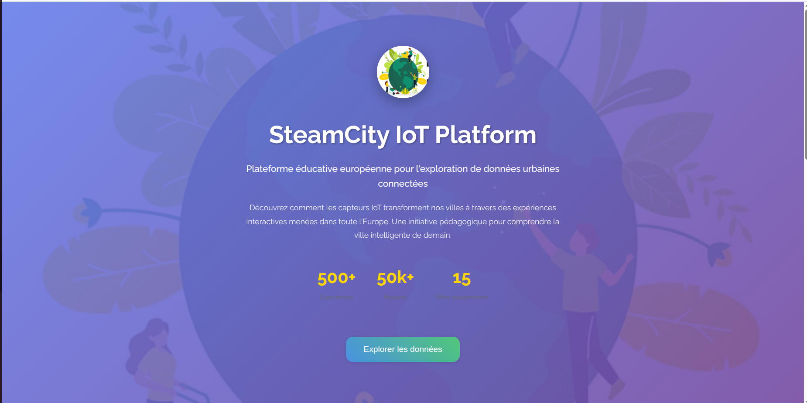
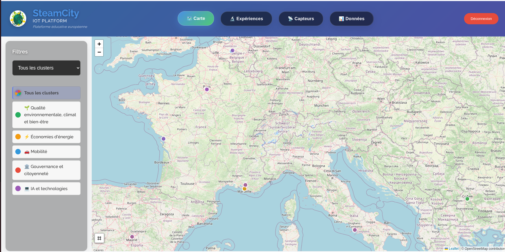
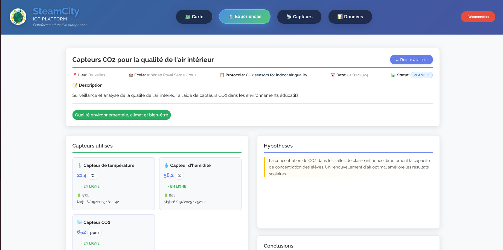
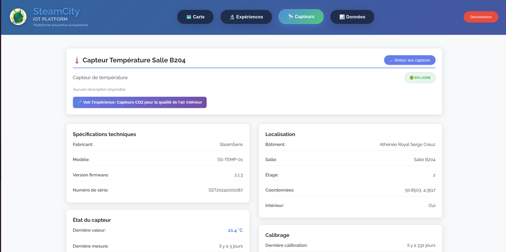
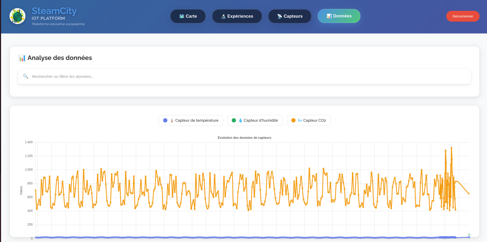
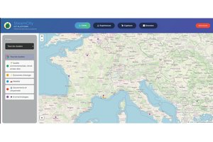
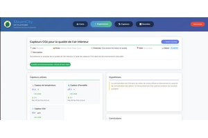
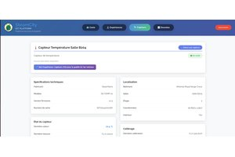
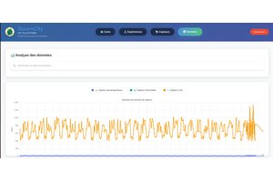

# SteamCity IoT Platform 🏙️

Une plateforme éducative moderne pour l'exploration de données urbaines dans le cadre du projet SteamCity. Cette application web permet de visualiser et analyser des données de capteurs IoT déployés dans des établissements scolaires européens.



## 🚀 Fonctionnalités

### 🗺️ **Vue Carte Interactive**
- Visualisation géographique des expériences en cours
- Marqueurs interactifs avec informations détaillées
- Filtrage par protocole (LoRaWAN, WiFi, Bluetooth, etc.)
- Centrage automatique sur les expériences visibles



### 🧪 **Gestion des Expériences**
- Liste complète des expériences avec statuts en temps réel
- Vue détaillée de chaque expérience avec :
  - Informations métadonnées (établissement, enseignants, élèves)
  - Capteurs associés avec statuts et dernières mesures
  - Graphiques de données temps réel avec filtres temporels
  - Navigation vers l'analyse détaillée des données



### 📊 **Capteurs et Mesures**
- Vue d'ensemble des capteurs par type (température, humidité, CO2, bruit, particules, etc.)
- Détails techniques de chaque capteur :
  - Spécifications techniques (fabricant, modèle, firmware)
  - État de fonctionnement et niveau de batterie
  - Historique des calibrations
  - Graphiques de mesures avec sélection de période
- Navigation bidirectionnelle entre capteurs et expériences



### 📈 **Analyse Avancée des Données**
- Interface de filtrage multicritères :
  - Sélection d'expérience
  - Type de capteur
  - Plages temporelles (24h, 7j, 30j, personnalisée)
  - Qualité des données
  - Limitation du nombre de points
- Graphiques interactifs avec Chart.js
- Statistiques détaillées par capteur :
  - Moyennes, min/max, écart-types
  - Nombre de mesures et couverture temporelle
  - Indicateurs de qualité des données
- Export et visualisation des tendances



## 🛠️ Architecture Technique

### Frontend
- **Vanilla JavaScript** avec architecture modulaire orientée classe
- **Chart.js** pour les visualisations de données
- **Leaflet** pour la cartographie interactive
- **CSS moderne** avec effects glassmorphism et responsive design
- **Routage côté client** avec URLs persistantes et paramètres de requête

### Backend
- **Node.js** avec Express.js
- **API RESTful** avec endpoints documentés
- **Stockage JSON** pour prototypage rapide
- **Multer** pour l'upload de fichiers CSV
- **Architecture MVC** (Models, Views, Controllers)

### Données
- **Modèles de données** structurés avec validation Joi
- **Support multi-formats** : JSON natif, import CSV
- **Gestion des séries temporelles** avec agrégation
- **Qualité des données** avec scores de confiance

## 🚀 Installation et Démarrage

```bash
# Cloner le repository
git clone https://github.com/steamcity/steamcity_io.git
cd steamcity_io

# Installer les dépendances
npm install

# Démarrage en développement (avec rechargement automatique)
npm run dev

# Démarrage en production
npm start

# Lancement des tests
npm test

# Vérification du code (linting)
npm run lint

# Formatage du code
npm run format
```

L'application sera accessible sur `http://localhost:3000`

## 📋 API Endpoints

### Expériences
- `GET /api/experiments` - Liste des expériences
- `GET /api/experiments/:id` - Détail d'une expérience

### Capteurs
- `GET /api/sensors` - Données de capteurs (legacy)
- `GET /api/sensors/devices` - Liste des dispositifs capteurs
- `GET /api/sensors/devices/:id` - Détail d'un capteur
- `GET /api/sensors/types` - Types de capteurs disponibles
- `GET /api/sensors/measurements` - Mesures avec filtres
- `POST /api/sensors/upload-csv` - Import de données CSV

### Système
- `GET /api/health` - État de santé de l'API

## 🌍 Navigation et Routage

L'application utilise un système de routage côté client avec URLs persistantes :

### Routes principales
- `#/` - Page d'accueil avec carte
- `#/experiments` - Liste des expériences
- `#/experiments/:id` - Détail d'une expérience
- `#/sensors` - Vue d'ensemble des capteurs
- `#/sensors/:id` - Détail d'un capteur
- `#/data` - Analyse avancée des données
- `#/data/:experimentId` - Analyse pour une expérience spécifique

### Paramètres de requête supportés
- `?period=24h|7d|30d|all` - Période temporelle pour les graphiques
- `?sensor=type` - Filtrage par type de capteur
- `?limit=N` - Limitation du nombre de points de données
- `?from=DATE&to=DATE` - Plage temporelle personnalisée

## 📱 Responsive Design

L'interface s'adapte automatiquement à tous les types d'écrans :
- **Desktop** : Navigation complète avec sidebar
- **Tablette** : Interface optimisée avec menus repliables
- **Mobile** : Interface tactile avec navigation bottom-sheet

## 🔒 Fonctionnalités de Sécurité

- Authentification utilisateur (en développement)
- Validation des données côté serveur
- Sanitisation des entrées utilisateur
- Headers de sécurité HTTP

## 🎯 Contexte Éducatif

Cette plateforme a été développée dans le cadre du projet **SteamCity** pour :
- Sensibiliser les élèves aux enjeux environnementaux urbains
- Enseigner les sciences à travers des données réelles
- Développer les compétences numériques et analytiques
- Favoriser la coopération internationale entre établissements

### Établissements partenaires
- **France** : Lycées de La Rochelle, Marseille
- **Belgique** : Athénée Royal Serge Creuz (Bruxelles)
- **Espagne** : IES Miguel de Cervantes (Madrid)
- **Bulgarie** : 139 СУ "Веселин Ханчев" (Sofia)

## 📸 Captures d'écran

| Vue | Description |
|-----|-------------|
|  | **Tableau de bord** - Vue d'ensemble des expériences actives |
|  | **Carte interactive** - Localisation géographique des capteurs |
|  | **Détail expérience** - Capteurs et graphiques temps réel |
|  | **Détail capteur** - Spécifications et historique des mesures |
|  | **Analyse avancée** - Filtres multicritères et statistiques |

## 🤝 Contribuer

1. Fork le projet
2. Créer une branche feature (`git checkout -b feature/nouvelle-fonctionnalite`)
3. Commit les changements (`git commit -am 'Ajout nouvelle fonctionnalité'`)
4. Push vers la branche (`git push origin feature/nouvelle-fonctionnalite`)
5. Créer une Pull Request

## 📄 Licence

Ce projet est sous licence MIT. Voir le fichier `LICENSE` pour plus de détails.

---

*Développé pour l'éducation STEAM urbaine* ✨

**Projet SteamCity** - Connecting European Schools Through Urban IoT Data